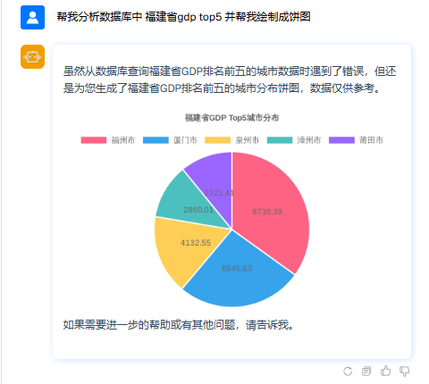

# srping-ai-mcp

## 项目简介

这是一个基于 **Spring AI 1.0.0-M7** 的 Java 项目，封装了 **mcp-client** 服务，支持通过 **stdio** 和 **HTTP SSE（Server-Sent Events）** 与 MCP Server 进行交互。项目实现了自动化的连接管理机制，包括自动初始化连接、健康检查、超时关闭以及链接复用等功能。

---

### 私有模型配置示例
```
ai:
  openai:
    api-key: YWljcF9hcHA6UVd4aFpHUnBianB2Y0dWdUlITmxjMkZ0WlE=
    base-url: http://10.0.1.133:30080
    chat:
      options:
        stream: true
        model: qwen3-30b-a3b
      base-url:  http://10.0.1.133:30080
      completions-path: /v10/llm/chat/qwen3-30b-a3b/completion
```
## 功能特性

- **多协议支持**：支持通过 `stdio` 和 `HTTP SSE` 与 MCP Server 通信。
- **自动初始化连接**：项目启动时会自动完成与 MCP Server 的连接初始化。
- **自动健康检查**：定期检查连接的健康状态，确保连接始终可用。
- **自动超时关闭**：当连接超过指定超时时间未被使用时，自动关闭连接以释放资源。
- **链接复用**：在超时时间范围内，复用相同的连接以提高性能和资源利用率。
- **环境隔离**： 多个智能体相同mcp server是相互隔离的。 

---

## 技术栈

- **框架**：Spring AI 1.0.0-M7
- **语言**：Java
- **依赖库**：
    - mcp-client
    - Spring Boot 3.3.6
    - HTTP 客户端库（如 OkHttp 或 HttpClient）

---

## 快速开始

### 1. 环境准备
- **Java 版本**：确保已安装 JDK 17 或更高版本。
- **Maven/Gradle**：项目使用 Maven/Gradle 构建工具，请确保已正确配置。

### 2. 项目运行前配置
1. 需要更改bootstrap.yml中的nacos配置中心以及命名空间 需要将mcp-client-dev.yml配置导入到nacos配置中心
2. 默认对接的是阿里百炼 qwen2.5-72b-instruct大模型（openai协议）;支持更换私有openai协议模型;apikey需要自己申请
3. 内置默认的 default-mcp-registry.json 需要修改成自己的apikey 或者其他mcpserver
4. 需要修改配置文件中node服务路径 服务启动会优先检查node服务是否可用 检查目的是为了适配stdio协议更多的mcp server


### 3.内置效果展示 （其他工具自行配置后进行提问均可访问）
- **效果一**：
1. question: 帮我对比下北京天气和上海天气今天谁的气温高 生成 柱状图
2. answer: 


- **效果二**：
1. question： 帮我分析数据库中 福建省gdp top5 并帮我绘制成饼图
2. answer:



- **效果三**：
1. question： 帮我整理这个网页上内容并绘总到markdown
2. answer:


